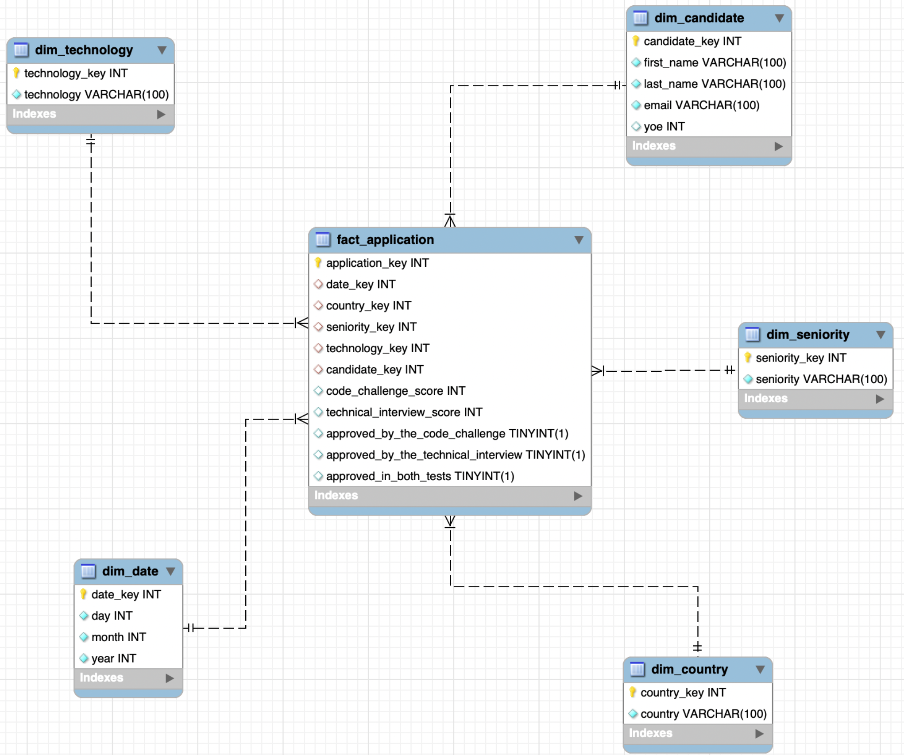

# ETL_workshop
This repository contains the workshop development by Valentina Morales.
# Case development

A company has a CSV file with 50,000 rows of candidate request data from technical selection processes where each row represents a candidate request. With this, we want to be able to generate analytical queries and key performance indicators so that they are easy to interpret.

The first step that was taken into account is the realization of the requirements where it was understood that the company needed to respond with this from that the respective KPIs that were related to the requirements were made. Through the use of the grain, it was determined which dimensions were needed and what was going to be the level of complexity of each of them, dividing an attribute such as the Application Date into 3 new attributes (Day, month and year), in addition to adding other attributes that were considered important to answer the KPIs. Among other things, each of the attributes was divided by the dimensions we had decided.

## Grain table

| **category**            | **attribute**  | **attribute** | **attribute** | **attribute** |
|-------------------------|----------------|---------------|----------|---------|
| **Candidate dimension** | **First Name** | **Last Name** | **Email**|  **YOE**|
| **Seniority dimension** | **Seniority**  |               |          |         |
| **Country dimension**   | **Country**    |               |          |         |
| **Date dimension**      | **Application Date = Day, month, year** | |         |         |
|----------------------|----------------|---------------|----------|---------|---------|
|**Fact Table**|
|----------------------|----------------|---------------|----------|---------|---------|
| **Technical Interview Score**| **Approved by the Code Challenge** | **Approved by the Technical Interview** | **Approved in both tests** | **Code Challenge Score** |

## Table related to KPIs

It was decided to create a table of facts called **Application** this will contain 5 attributes of which 3 of them will be created by me because they are not in the original database, this to supply the need to have specific data that in this case will be BOOLEAN to more easily answer the doubts that are presented in the KPIs where it is asked to recognize which are the candidates who were hired in addition to information related to their scores in the tests, following the approval standards of the company, the rest of these attributes will represent the scores obtained in the tests by the candidates.

It also considered the dimension with which it was going to be related, the type of visualization and the justification of its commercial value for each of the KPIs to have a clearer knowledge of what was needed.

| Requirements | KPIs | Dimensions | Visualization Type | Commercial Value Justification |
|--------------|------|------------|--------------------|--------------------------------|
| How many hirings are there for each of the technologies? | Hires by Technology | Technology | Bar chart | Allows the company to see which technologies are most demanded by the company and which ones have the highest hiring index. |
| How many hires are there for each year? | Hires by Year | Date | Line graph | Allows the company to see in which years more hiring was made and in which not to evaluate how growth is going in addition to planning a budget. |
| How many hires are there according to the Seniority level? | Hires by Seniority | Seniority | Bar graph | Allows the company to see which seniority of technologies is the most hired and which not in order to control salaries and measure if more is being invested in experienced talent or internal training in the company. |
| How many hires are there for each country? | Hires by Country over Years (Focus on USA, Brazil, Colombia, Ecuador) | Country | line graph | Allows the company to see which are the countries from which most staff was hired, this allows to analyze international expansion and where the market should be prioritized. |
| What is the average score obtained by the candidates in the Code Challenge? | Average score of the Code Challenge | Candidate | KPI Card | Allows the company to see what are the average scores obtained by the candidates who apply, this serves to evaluate how the performance in the tests is being and whether the results obtained are higher or lower than expected, thus identifying skills gaps and the effectiveness of the selection process. |
| What is the percentage of hiring in the registered years? | Hiring percentage | Candidate | Pie chart | Allows the company to see how many of the registered candidates have been hired for passing the tests. This is representative because they estimate how the quality of the applicants is being to pass the proposed requirements and helps to optimize selection costs. |
| What is the average year of experience of the people who were hired? | Average years of experience | Candidate | KPI Card | Allows the company to estimate the years of experience of the people who are hiring in order to evaluate the general level of experience of the contracted people, help balance the work teams and help in salary decisions. |

This process resulted in the division into 5 dimensions because each of them is an essential source to answer the KPIs so the information can be obtained more easily in a more optimized way looking for the search and use to be as efficient as possible, resulting in a star-type dimensional data model That can be seen done in the MySQLWorkbench application.

## Libraries required for its use

1. pandas
2. Os
3. Sqlalchemy
4. datetime
5. tabulate
6. log
7. streamlit
8. matplotlib.pyplot
9. seaborn

## ETL process
For the ETL process it consists of three parts:

1. Extraction: In this process we will use the CSV "candides.csv" that will be stored in data/raw. This is the original dataset provided that will give us the preliminary information to perform the ETL process, in src/extracto.py the process of extracting the dataset data is carried out by taking all that raw data to be able to use them. For this part we would only need the Pandas bookstore.

2. Transformation: This part will be in src/transform.py in it mainly the dimension tables will be made which in this case are 5 and also the fact table which is the main one in this case will be called application later the transformed data will be stored in the data/transformed folder where the different tables will be in csv files. For this part we would only need the Pandas bookstore.

3. Load: This part will be in src/load.py where the loading process will be performed on the date werehause this by means of (engine = create_engine( f”mysql+pymysql: root:valemoravale@localhost:3306/recruitment_dw”)) this part carries the data from my work environment in MySQLWorkbench. In this case, several libraries will be needed which are: the OS library that is used to interact with the operating system; the sqlalchemy library that is used to facilitate communication between Python and relational databases and pandas.

Other files that will be used are: 
1. src/log.py where the logs will be generated that will allow you to see the executions and errors of the program in the logs folder as a text file, for this the datetime library will be needed

2. src/main.py which is where the top-level code is executed for the panda libraries will be used, tabulated to make text tables, streamlit which is used to create interactive web applications and data visualizations quickly and log.

In the main you will have to take into account the routes that are established which are:

- log_file = r"/Users/valemoravale/Documents/UNIVERSIDAD /Semestre 5/ETL/Lab4/Python/logs/log_file.txt" Stores the logs
- target_file = r"/Users/valemoravale/Documents/UNIVERSIDAD /Semestre 5/ETL/Lab4/Python/data/transformed” Stores the transformed data
- data_path = r"/Users/valemoravale/Documents/UNIVERSIDAD /Semestre 5/ETL/Lab4/Python/data/raw/candidates.csv” Route where the raw dataset is

## Bi process

For this process, streamlit was used, which is an open source Python library designed to create interactive web applications and data visualizations quickly to be able to visualize the development of KPIs, first the bi/dw_connection.py folder was created where the connection was created with the date werehause that was created in MySQLWorkbench, in this case the mysql.connector library will be used and the data that will be provided are those of my MySQLWorkbench unit.

To perform the visualizations (graphics) the src/streamlit_app.py folder was used where each of the SQL queries and the respective graph will be made using the Python streamlit library, these graphics will later be saved in the output folder in both CSV and PNG files to be displayed, the libraries that will be used will be streamlit, pandas, matplotlib.pyplot and seaborn.

This can also be executed from the browser using the command in the terminal (streamlit run src/streamlit_app.py) after running all this will allow you to see all the graphics together.

